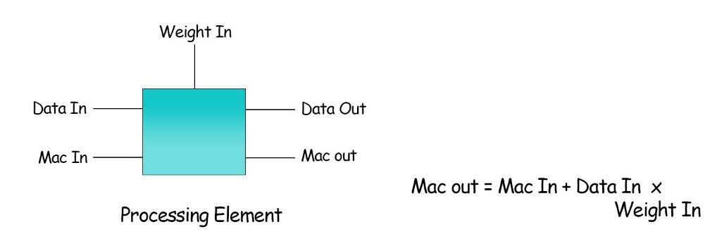
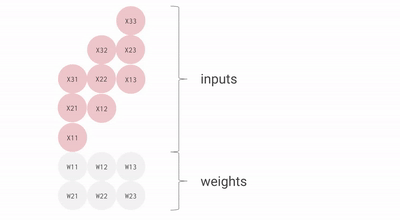
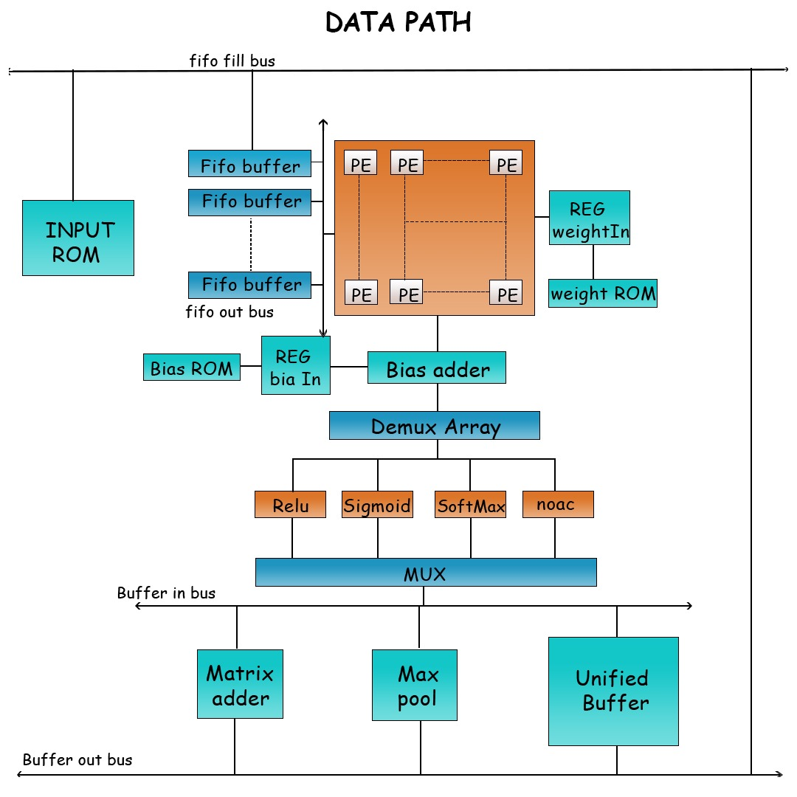
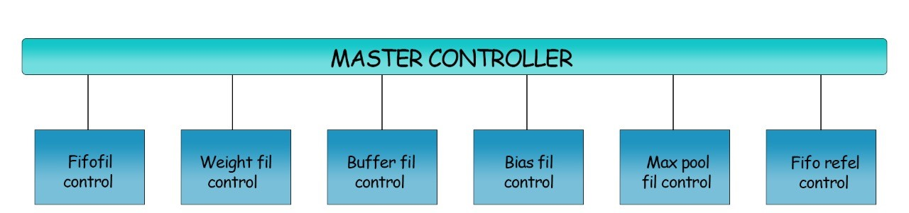
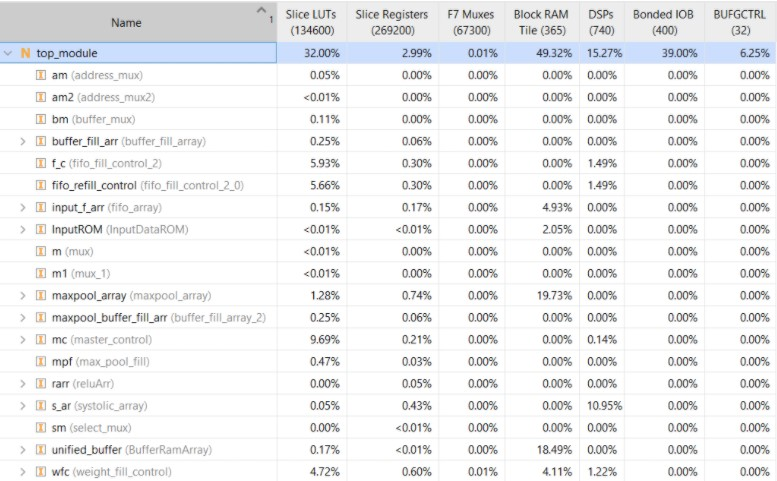
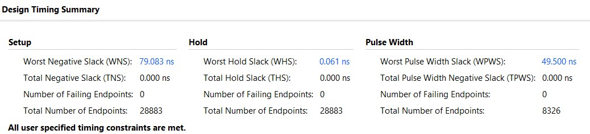
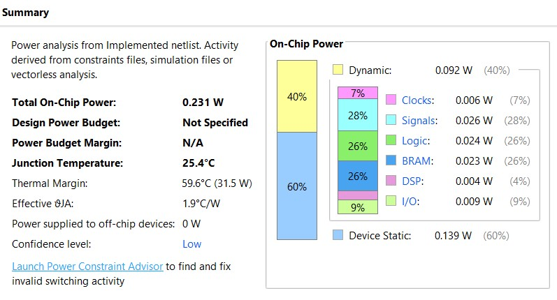

# CNNSOnFPGA

# Introduction

Convolutional neural networks are proved to be excellent in the world of computer vision. But it involves a lot of computation work which takes a lot of time to be done. This project aims at developing a hardware accelerator which can make these computations faster. 

# Methodology

Designing a good architecture for the hardware accelerator is one of the main parts of the project. Systolic array is the heart of our architecture. Systolic arrays are hardware structures built for fast and efficient operation of regular algorithms that perform the same task with different data at different time instants. In our model systolic array is used to perform matrix multiplications. 

The above figure shows the model of the processing element used in our accelerator.
Systolic array is an array of these processing elements. The following GIF illustrates the idea of systolic array

Since memory can be operated at higher speeds a fifo is designed to store the elements in the buffer to overcome cross domain clocking problems. Many small BRAM blocks are used to reduce waiting time in the buffer before writing the processed data into memory.
The designed architecture is implemented in verilog HDL using Xilinx Vivado design suite. All the required modules in the datapath are implemented in verilog. The datapath elements are then connected together in a top module. Control modules are developed to control the flow of data between the datapath modules. Master control module is designed to send control signals to all the control modules and the datapath modules based on the current instruction and previous instructions executed.

There is currently support for seven high level instructions in our architecture.

We are using fixed point calculations in our architecture. Tensorflow has a good post training quantisation technique which quantises the 64 bit floating point weights into 8 bit integers. We can extract those weights and biases and computation graph from the model. The extracted weights and biases can be used for our accelerator. The extracted model can be converted into a set of instructions which can be used to run on our accelerator.

# Architecture

## Data Path

* Systolic Array
	* Processing Element
* FIFO array
	* FIFO
* MUXES
* Bias adder
* demux array
	* demux
* Activations
	* Relu
	* Sigmoid
* 2*2 Max pooling
* ROM
	* Weight and Bias ROM
	* Input ROM
* Buffer ram array
	* Buffer RAM
* Matrix adder

## Control path

* Master Control
* FIFO fill control
* FIFO refill control
* Weight fill control
* Bias fill control
* Buffer fill control
* Maxpool fill control
* Buffer refill control

# Supported instructions 

Each instruction lenght - 64 bit

opcode:- 5 bit

* Weight fill
	* opcode = 00001
	* Weight initial address = 15 bits
	* Weight size = 16 bits
	* number of filters = 16 bits
* Fifo clear
	* opcode = 10000
* Fifo fill
	* opcode = 00010
	* fifo initial address = 14 bits
	* image height = 16 bits
	* image width = 16 bits
	* fifo offset = 7 bits  
* Fifo refill
	* opcode = 00101
* Conv
	* opcode = 00011
	* activation code = 4 bits
	* output feature map size = 16 bits
	* buffer initial address = 16 bits
* Maxpool
	* opcode = 00100
	* maxpool initial address = 16 bits
	* output feature map size = 16 bits
	* buffer initial address = 16 bits
* Add matrices
	* opcode = 00111
	* in address = 14 bits
	* out address = 14 bits

# Python

Python notebook contains code for converting onnx model into a python dictionary containing weights and biases. 

# Results 

The Hardware accelerator is simulated with the following instructions.

Instructions Executed:-

Weight_fill 0 3 9
Fifo_clear 
Fifo_fill 0 5 5 0
Conv 1 9 0
Maxpool_fill 0 4 0
weight _fill 0 3 9
Fifo_clear
Fifo_refill 0 2 2 1 9
Conv 1 9 0

## Simulation output :-

Click on the image to view simulation video

## Resource utilisation :-

## Timing Summary

## Power Summary

# Current Status and future work

Current version of the hardware accelerator can be scaled only upto 16x16 matrix multiplication unit. Instruction generator is under development. The accelerator is yet to be deployed and tested on to FPGA. Post synthesis and Post implementation functional simulation is verified. Timing simulation is yet to be done.
 
Future work for this project includes:-
* Improve the architecture with software optimisations in consideration
* Add DDR3 memory or other external memory support
* SD card support for live camera detection
* Improve the matrix multiplication model with a better architecture 
* Improve timing constraints

